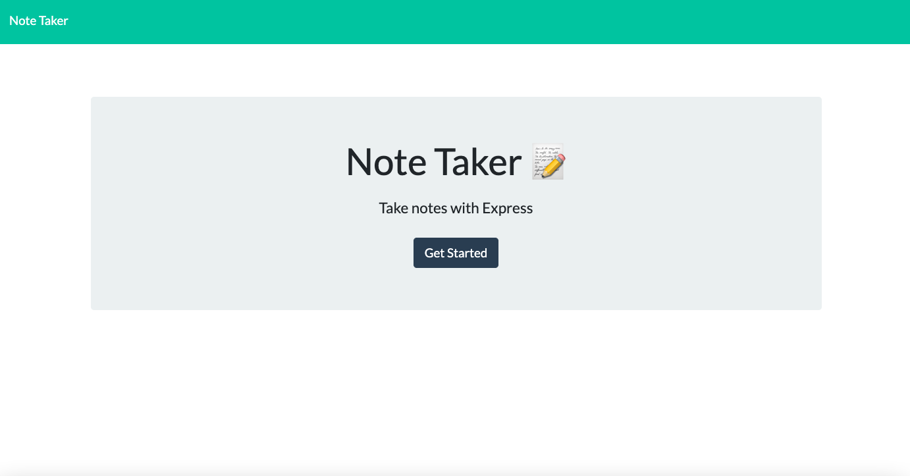

# Note Taker

  

  
  
  
  

  ## Description

The purpose of this project was to implement Express concepts to create a full-stack application that allows the user to write and save notes. While building this project, I became comfortable using Express to handle GET, POST, and DELETE requests. I learned how to implement proper communication between the front and back end.

  ## Installation

  N/A

  ## Usage

  To access this application, visit the following URL: [https://express-note-taker-rp.herokuapp.com/](https://express-note-taker-rp.herokuapp.com/). Click the "Get Started" button to start a list of notes.

  

 Click in the text area to start adding a new note, then click the save button to save it.

 

 Once a note is created, users may either click on the note to view it, or click on the red icon next to it to delete it.

 

 To add another note, click on the plus icon.

 

  ## Credits

This project was based on the starter code from the miniature-eureka repository belonging to the GitHub user @coding-boot-camp.

  ## License

  This application is covered under the MIT License.
  To view a description of this license type, refer to the repo or click [here](https://opensource.org/licenses/MIT).

  ## Contributing

  Ways to contribute include suggesting bug fixes.
  
  ## Tests

  N/A

  ## Questions

  If you have any questions or would like to provide feedback, do not hesitate to view my GitHub profile at [https://github.com/rpecuch](https://github.com/rpecuch) or contact me at rpecuch@comcast.net.
